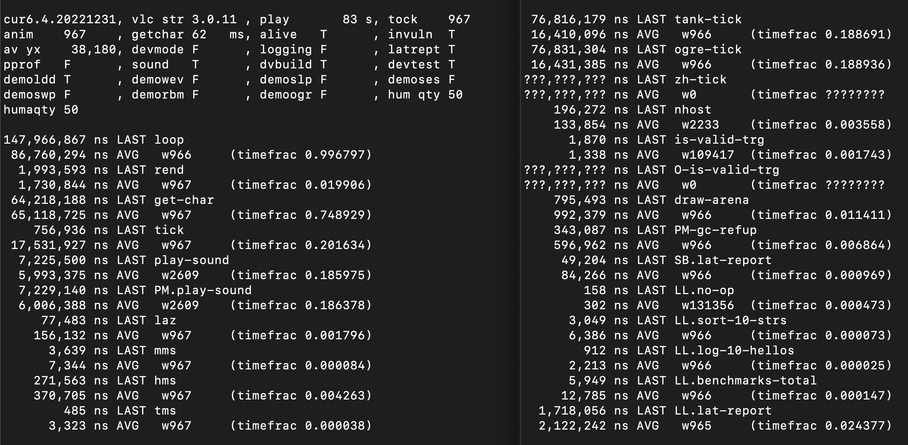

latlearn (aka latlearn.go, LatencyLearner, or LL)
    by Mike Kramlich

https://github.com/mkramlich/latlearn

This is a simple instrumentation API and library for Golang software. For measuring and reporting the latency performance of code. Across arbitrary spans. Spans that you name with simple strings.

For each span you instrument it will determine the minimum latency ever observed for it, and the maximum, the mean, and the remember the last value observed as well. It can report all these plus the "weight" of that mean (essentially, the number of completed before()/after() pairs), as well as the "time fraction" spent in/under that span, since latlearn_init was called. All latencies are measured and reported in nanoseconds.

It supports both "expected" spans -- ones mainly where you care about having a stable ordering of them when printed in the report. As well as "ad hoc" spans. You can also choose to do either an "eager init" of latlearn, or a lazy init. A lazy init happens if you call llB() before having previously made an explicit call to init latlearn. In that case, latlearn will init itself (prepare it's internal state as needed) for you, under the hood.

Latlearn also tracks the cost of its own measurements and reporting. And includes a few built-in benchmarked tasks, to help the user quick make apples-to-apples comparisons when trying to interpret the meaning of the numbers they are seeing in their own reports. This also helps when comparing results ran on different machines with possibly wildly different hardware capabilities or external dependencies (network stacks, persistance backends, etc.) All of latlearn's built-in measurements have a "LL." as the prefix of the span name.

Simplest Example:
```
ll := llB( "foo")
foo()
ll.A()
latlearn_report()
// it just wrote a report (on latency stats) into a file at "./latlearn-report.txt"
```

For more complex examples, features and permutations see `./example-app1.go` and use `./buildrun.sh` to run it.

Extracted from slartboz.go on 2023 Sep 10 around 10:30am local time,
from the private/closed-source Slartboz game's source tree -- where
it was homegrown by its creator to meet that game's early needs for:

    * in-game UX monitoring & dynamic adjustment of task strategies, to maintain QoS
    * benchmark regression tests (for basic QA automation & CI/CD pipelines)
    * engine performance tuning & optimization refactors

To help understand what latlearn can do, there is a screenshot included of a metrics dashboard window. One run from a terminal, and based on a 'watch' of a report file. This file is generated only when an app calls the fn in this module named latency_report_gen. The screenshot is:


It is not intended to meet everyone's needs. It scratched an itch, in-house. And it has the benefit of being well-understood by its creator, with no surprises. And it is easy to enhance or augment where desired.

More to come! There is more LL-related code to extract from Slartboz (and clean up, of course.) And there's an in-house list of ideas for further enhancement.

For more info on Slartboz (a new sci-fi, post-apoc, real-time Rogue-like, in Golang):
    https://github.com/mkramlich/slartboz-pub

To contact the author, email him at:
    groglogic@gmail.com

thanks

Mike
2023 September 11

